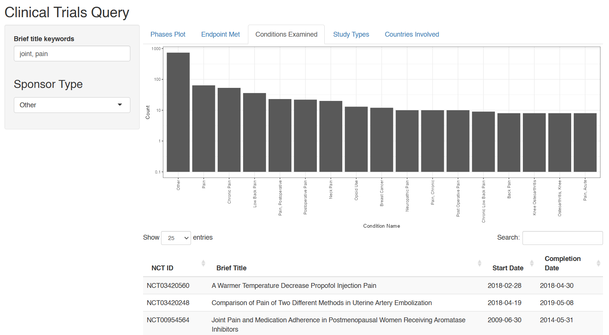

# Clinical Trials Interactive Dashboard

Visit the [link](https://leafsphere.shinyapps.io/clinical_trials/) in the About section to try out the live app!

The goal of this R Shiny app is to provide a user-friendly interface that
allows the viewer to explore a large database of clinical studies.
The interactive dashboard lets the user to query clinical trials based on 
their keyword(s) of interest and subsequently shows relevant data visualizations 
and tables pertaining to the results, such as what phases the studies were in, what
countries were involved, and what conditions were examined.

As an example to use the search bar, enter `joint pain` if you want to return results
that contain the consecutive words together. If you want results with *either* `joint`
or `pain` in the title, use a comma to separate the keywords as such: `joint, pain`.
